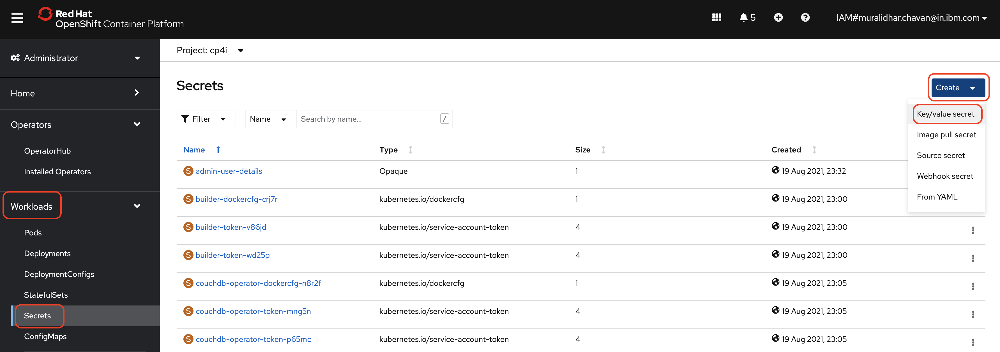
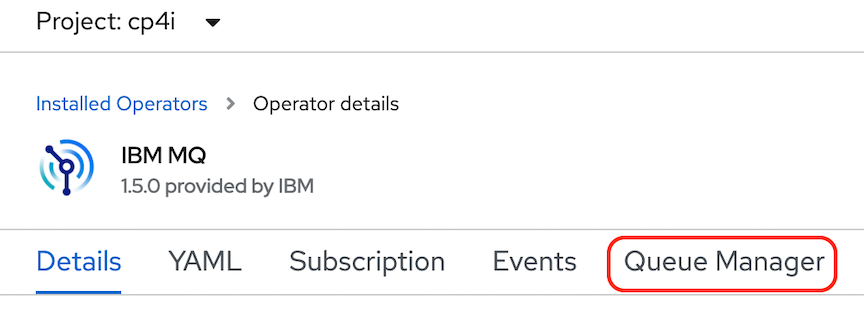
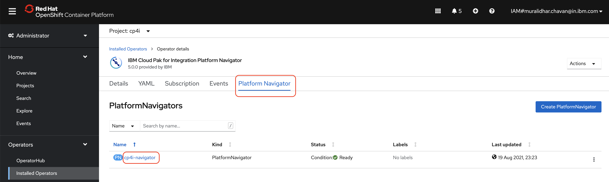
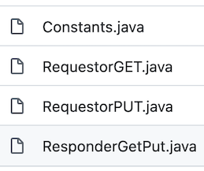

# Work in progress

# Integrate your on-premises application and Cloud application with IBM Cloud Pak for Integration

The need for integrating two applications could arise in various scenarios. Two common scenarios are:
- Application modernization where the modernized part of the application has to be integrated with the legacy application.
- Hybrid cloud solution deployment where the two different parts of the application has to be integrated.

IBM Cloud Pak for Integration (CP4I) has capabilities that includes API management, application and data integration, messaging and events, high-speed transfer, and end-to-end security.

This code pattern demonstrates how to connect your cloud and on-premises applications and deliver messages reliably with enterprise-grade messaging using IBM MQ and App Connect Enterprise components of IBM Cloud Pak for Integration(CP4I). 

In this code pattern, you will look at a shipment tracking scenario. The details are as follows.
- There are two applications. A requester client application that needs a shipment status information from a responder application. 
- The requester client application sends a request message, in XML format, for shipment status. 
- The responder client application accepts request messages in JSON format and responds with shipment tracking details in JSON format. 
- The communication mechanism between requester and responder applications happen asynchronously

These applications are deployed outside the Cloud Pak for Integration cluster. IBM MQ is used as the messaging engine providing a reliable and secure messaging platform. The App Connect Enterprise(ACE) is used as the integration platform. While ACE delivers a platform that supports the full breadth of integration needs across a modern digital enterprise, in this case it being used for the following:
- To host an application integration flow (developed using ACE toolkit)
- To transform XML messages to JSON and vice-versa using low-code approach.

When the reader has completed this pattern, they will understand how to:
- Setup MQ queue manager security with [TLS](https://www.ibm.com/docs/en/ibm-mq/9.0?topic=mechanisms-tls-security-protocols-in-mq)
- Deploy App Connect Enterprise flows
- Integrate MQ with applications outside of CP4I cluster as well as applications (ACE flows) inside of CP4I cluster
- Run simple Java JMS applications to test the complete set up

<!-- Include this image if required  -->


## Flow
1. Requester app puts a shipping tracking request, in XML format, to an MQ queue (REQUEST.IN)
2. ACE picks requester app request from MQ queue (REQUEST.IN) and transforms XML message to JSON message
3. ACE puts the JSON message to an MQ queue (REQUEST.OUT)
4. Responder app picks the JSON message from the MQ queue (REQUEST.OUT) and prepares a response message
5. Responder app puts the response message, in JSON format, to an MQ Queue (REPLY.IN)
6. ACE picks the response message from Queue (REPLY.IN), transforms the message from JSON to XML format
7. ACE puts the XML response message to an MQ queue (REPLY.OUT)
8. Requester app picks the response message from the MQ queue (REPLY.OUT)

## Included Components
- [IBM Cloud Pak for Integration](https://developer.ibm.com/components/cloud-pak-for-integration/)
- [IBM MQ](https://developer.ibm.com/components/ibm-mq/)
- [IBM App Connect](https://developer.ibm.com/components/app-connect/)

## Featured technologies
- [Java](https://developer.ibm.com/components/java-platform/)
- [TLS security protocols in IBM MQ](https://www.ibm.com/docs/en/ibm-mq/9.0?topic=mechanisms-tls-security-protocols-in-mq)

## Prerequisites
- [IBM Cloud Pak for Integration (CP4I) v2021.2.1-0](https://cloud.ibm.com/docs/cloud-pak-integration?topic=cloud-pak-integration-getting-started)
- [OpenSSL](https://www.openssl.org/source/)
- [Java JRE](https://www.java.com/en/)
- [git client](https://git-scm.com/downloads)
- [oc client](https://docs.openshift.com/container-platform/4.8/cli_reference/openshift_cli/getting-started-cli.html)
- [kubectl client](https://kubernetes.io/docs/tasks/tools/)

## Steps
1. [Clone the repository](#1-clone-the-repository)
2. [Create TLS objects](#2-create-tls-objects)
3. [Create an instance of MQ Queue Manager](#3-create-an-instance-of-mq-queue-manager)
4. [Configure MQ instance for TLS](#4-configure-mq-instance-for-tls)
5. [Connect to your MQ instance from outside the cluster](#5-connect-to-your-mq-instance-from-outside-the-cluster)
6. [Deploy ACE flows](#6-deploy-ace-flows)
7. [Test the complete set up](#7-test-the-set-up)

### 1. Clone the repository
Clone the repository using the below command
```
git clone https://github.com/IBM/applications-integration-using-ibm-cloud-pak-for-integration.git
```

### 2. Create TLS objects
TLS is used in MQ to secure channels. The TLS handshake enables the TLS client and server to establish the secret keys with which they communicate. Let us create a self-signed certificate and extract the public key from it for the client to use. A self-signed certificate is signed with its own private key.

#### 2.1 Create self signed certificates for server and client

In a terminal window, change directory to parent folder of cloned repository.

Create self signed certificate for the server using the below command
```
openssl req -newkey rsa:2048 -nodes -keyout server.key -x509 -days 365 -out server.crt
```

You will be prompted to enter some information. Enter whatever you like. An example is provided below.
```
Country Name (2 letter code) []:IN
State or Province Name (full name) []:KA
Locality Name (eg, city) []:BLR
Organization Name (eg, company) []:Example
Organizational Unit Name (eg, section) []:Abc
Common Name (eg, fully qualified host name) []:example.com
Email Address []:abc@example.com
```

Verify the certificate has been created successfully with this command:
```
openssl x509 -text -noout -in key.crt
```

Similarly create self signed certificate for the client using the below command
```
openssl req -newkey rsa:2048 -nodes -keyout client.key -x509 -days 365 -out client.crt
```

### 3. Create an instance of MQ Queue Manager in CP4I
The MQ in Cloud Pak For Integration cluster is accessed by applications that are deployed outside the cluster. This requires TLS to be set up while the MQ queue manager is being created. The self signed certificates we created will be used to create secrets in our OpenShift cluster. These secrets will be used while creating an instance of Queue Manager.

#### 3.1 Set up TLS Certificates for MQ Deployment
For the sake of this code pattern, the CP4I instance is deployed in a namespace called `cp4i`.

**Create Server Secret**
1. Navigate to OpenShift console (where CP4I is deployed)
2. Click on `Workloads` -> `Secrets`. Select project `cp4i`
3. Click on `Create` -> `Key/value secret`

4. Fill the form as the following information
- Secret Name: `mq-server`
- Key: `tls.key`
- Value: Click `Browse` and select server.key that was generated in step [Clone the repository](#1-clone-the-repository)
- Click on `Add Key/Value`
- Key: `tls.crt`
- Value: Click `Browse` and select server.crt that was generated in step [Clone the repository](#1-clone-the-repository)
5. Click `Create`


**Create Client Secret**
1. Navigate to OpenShift console (where CP4I is deployed)
2. Click on `Workloads` -> `Secrets`. Select project `cp4i`.
3. Click on `Create` -> `Key/value secret`
4. Fill the form as the following information
- Secret Name: `mq-client`
- Key: tls.crt
- Value: Click `Browse` and select client.crt that was generated in step [Clone the repository](#1-clone-the-repository)

#### 3.2 Create an instance of MQ Queue Manager
1. Navigate to OpenShift console (where CP4I is deployed)
2. Click `operators` -> `Installed Operators`
3. Click on `IBM MQ` operator. You may search for the operator by typing `IBM MQ` in search field. Click on `IBM MQ` link.

4. Click on `Queue Manager` tab

5. Click `Create QueueManager` button available on the right side of the screen
6. Fill form details as follows
- Enter name as `qm1`
- Accept license

- Click `Advanced Configuration` at the end of the page
- Click on `PKI` -> `Keys` -> `Secret` -> `Advanced configuration` -> `Items` -> `Add Item`. Enter `Value` as `tls.key`. 
- Click `Add Item` link below. Enter `Value` as tls.crt. Select Secret `mq-server` from the dropdown.

- Click `Advanced Configuration` below and enter `Name` as `default`
- Next click on `Trust` -> `Secret` -> `Add Item. Enter `Value` as `tls.crt`
- Under `Secret name` dropdown select `mq-client`
- Click `Advanced Configuration` below and enter `Name` ad `label2`
- Scroll to the top of the page and select `YAML view` option. It should look as shown below. Make further changes, if required, either in form view or YAML view.
```
apiVersion: mq.ibm.com/v1beta1
kind: QueueManager
metadata:
  name: qm1
  namespace: cp4i
spec:
  license:
    accept: true
    license: L-RJON-BXUPZ2
    use: NonProduction
  pki:
    keys:
      - name: default
        secret:
          items:
            - tls.key
            - tls.crt
          secretName: mq-server
    trust:
      - name: label2
        secret:
          items:
            - tls.crt
          secretName: mq-client
  web:
    enabled: true
  version: 9.2.2.0-r1
  template:
    pod:
      containers:
        - env:
            - name: MQSNOAUT
              value: 'yes'
          name: qmgr
  queueManager:
    name: qm1
    storage:
      queueManager:
        type: ephemeral
```
7. Click `Create`

Queue Manager should be created and be in running status


### 4. Configure MQ instance for TLS

Once your MQ instance is up and running, configure it for authentication.

Launch CP4I platform Navigator
- Navigate to OpenShift web console -> `Installed Operators` under `cp4i` namespace and click `IBM Cloud Pak for Integration Platform Navigator` entry.

- Click `Platform Navigator` tab of `IBM Cloud Pak for Integration Platform Navigator` operator. Then click on the platform navigator entry there.

- Click on `Queue Manager` tab and click the queue manager qm1 created earlier. Under details tab, click the link under `Admin UI`

Under `Details` tab, click the link `Platform Navigator UI` to launch platform navigator.

The first time you attempt to access the MQ console a warning will appear regarding the certificate. This can be accepted as it is normally due to a self-signed certificate, or a unknown certificate authority. In a real production environment this would commonly be configured with a certificate that would be known by the browser.

1. Login to IBM Automation using the `IBM provided credentials (admin only)`. This will be the credentials that was provided when deploying Cloud Pak for Integration. Under `Messaging` tile, click the queue manager that you created in previous step [Create an instance of MQ Queue Manager](#32-create-an-instance-of-mq-queue-manager). Queue Manager home page is displayed.

2. Click on `Manage` -> `View configuration`


3. Click `Edit`
- Under `Communication` menu on the left hand side, select `CHLAUTH records` and select `Disabled` option.
- Under `Extended` menu on the left hand side, delete the text under the field `Connection authentication`

- Click `Save`

4. Create channel
- In queue manager console, click `Manage` -> `Communication` tab -> `App channels`. Click `Create`

- Click `Next`. Enter `Channel name` as `DEV.APP.SVRCONN`. Click `Create`.

- Follow the same steps to create another channel `DEV.ACE.SVRCONN`
> Note that we are creating two channels because Queue manager connects ACE flow as well as Java JMS clients. ACE flows are within the CP4I cluster and Java JMS clients are outside the CP4I clusters. We will setup different configurations to these channels to connect to different types of client. Note that the same channel can be configured for different types of client, but we'll not do that in this code pattern.
> `DEV.APP.SVRCONN` channel will be used by Java JMS clients and will be configured with TLS. `DEV.ACE.SVRCONN` channel will be used by ACE flows and we will leave this channel with default settings.

5. Configure channel
- On the queue manager console, view configuration of the just created channel

- Click `Edit` and select `SSL` on the left menu items. Under `SSL Cipher spec`, selection the option `ANY_TLS12`. Select `Optional` for `SSL Authentication`

- Click `Save`

6. Create local queues
- In queue manager console, click `Queues` tab. Click `Create`

- Click on `Local`. For `Queue name` enter `REQUEST.IN` and click `Create`

- Similarly create other queues required for this code pattern demonstration
`REQUEST.OUT`
`REPLY.IN`
`REPLY.OUT`
`REQUEST.IN.FAILURE`
`REQUEST.OUT.FAILURE`
`REPLY.IN.FAILURE`
`REPLY.OUT.FAILURE`

Make sure that you `Refresh Security` of the Queue Manager after making the security related changes. Go to the Queue Manager configuration and refresh all three types of securities one after another.


7. Get connection details
- Go to queue manager configuration. Under `Actions`, click `Download connection file`
- Under `Select a queue manager`, select the queue manager qm1. Under `Select an application channel` select the channel `DEV.APP.SVRCONN`. Under `Select a cipher specification` select `ANY_TLS12`
- Click next and make a note of hostname and port. These details are required later for client applications to connect to MQ.


### 5. Connect to your MQ instance from outside the cluster
Client applications that set the [SNI](https://en.wikipedia.org/wiki/Server_Name_Indication) to the MQ channel require a new OpenShift Route to be created for each channel you wish to connect to. You also have to use unique channel names across your Red Hat OpenShift cluster, to allow routing to the correct queue manager.

This is an example of the channel based SNI mapping:
| Channel         | SNI                 | suffix          |
| -----------     | -----------         | -----------     |
| DEV.APP.SVRCONN | dev2e-app2e-svrconn | chl.mq.ibm.com  |

Use this link to determine the SNI Mapping: [How does MQ provide multiple certificates (CERTLABL) capability](https://www.ibm.com/support/pages/ibm-websphere-mq-how-does-mq-provide-multiple-certificates-certlabl-capability)

We additionally need to create a route for each channel we want to connect to. The HostName of the new route will be the name of the channel mapped to it's SNI format (using the SNI mapping rules) with the suffix chl.mq.ibm.com.

Use the following yaml to create the correct route for DEV.APP.SVRCONN
From a terminal, logon to your OpenShift cluster and run the below command

```
cat << EOF | kubectl -n cp4i apply -f -

apiVersion: route.openshift.io/v1
kind: Route
metadata:
  name: qm1-ibm-mq-qm-traffic-dev
  namespace: cp4i
spec:
  host: dev2e-app2e-svrconn.chl.mq.ibm.com
  to:
    kind: Service
    name: qm1-ibm-mq
  port:
    targetPort: 1414
  tls:
    termination: passthrough
EOF
```

Use `oc get routes -n cp4i` to verify that the above route is created.

### 6. Deploy ACE flows
Ensure that App Connect is deployed in the CP4I instance that you are using.


ACE flow will be deployed as a bar file. A bar file, appint.bar, is provided and can be found under the folder `<cloned repo parent directory>/ACE`. There are two flows in the bar file. One flow transforms XML message to JSON (request flow) and the other flow transforms JSON message to XML (response flow). 

The bar file is preconfigured with default values used in this code pattern to connect to MQ. The appint.bar file won't work as exptected if the names of Queue manager, queues and channel are different from the ones used in this code pattern.

Launch CP4I platform Navigator as explained in section [Configure MQ instance for TLS](#4-configure-mq-instance-for-tls). In platform navigator dashboard, under `Integrations` tile, click on the entry available there. App Connect Dashboard opens.

- Click on the tile `Create a server`. 
- Select the tile `Quick start toolkit integration`. Click `Next`
- You need to provide a bar file. You can either drag and drop or click on the `Drag and drop a BAR file or click to upload` link.
- Upload the bar file `appint` placed in `<cloned repo parent directory>/ACE` folder
- Click `Next`. Again click `Next`.
- You may leave the default settings and click `Create`

- The integration server will take a few minutes to start. Wait for 3-4 minutes and refresh the browser page. The status of integration server should be `Ready`


### 7. Test the set up
To send/receive messages to/from MQ queues, sample applications are provided in this code pattern. These sample applications are JMS Java applications. These files are located in the directory `<cloned repo parent directory>/Client/Apps/com/ibm/mq/samples/jms`



- `RequestorPUT.java` puts a shipping tracking request message, in XML format, to the queue REQUEST.IN
- `ResponderGetPut.java` takes JSON request message from REQUEST.OUT. It builds a response message, in JSON format, and puts the response message in REPLY.IN queue.
- `RequestorGET.java` gets response message, in XML format, from REPLY.OUT queue
- `Constants.java` holds connection details to queue manager.

Update connection details in Constants.java file. You can get connection details as explained in section [Configure MQ instance for TLS](#4-configure-mq-instance-for-tls).

**Create a client keystore**
The Java JMS application should provide valid certificate details for it to communicate with Queue Manager. In earlier step [Create self signed certificates for server and Client](#21-create-self-signed-certificates-for-server-and-client) we created server key and certificate. We will create a client keystore using that server certificate. We will use keytool (a Java security tool), which is included with Java JREs and SDKs.

On a terminal window change directory to where `server.key` and `server.crt` are placed. To create a .jks client keystore and import our server certificate into it, run the following command in the terminal:
```
keytool -keystore clientkey.jks -storetype jks -importcert -file server.crt -alias server-certificate
```
You will be prompted to create a password. Be sure to remember the password that you set as you’ll need it later on.

Move the clientkey.jks file into `<cloned repo parent directory>/Client/ClientKey`. You can place it in any new folder that you like, but for the script to run, place it in the folder mentioned. 

Now that the client keystore is available, let us run the application. 

There is a script `<cloned repo parent directory>/Client/Apps/runClientApps.sh` which will compile and run these java files. This script takes 2 arguments. First argument is a shipment number, it can be any string for the purpose of this demo. The second argument is the password that you specified while creating client kaystore (.jks file).

On a terminal window, change directory to Client/Apps folder of the cloned git repository and run the script
```
cd <cloned repo parent directory>/Client/Apps/
./runClientApps.sh ship001 <password>
```

Observe the console log messages. You will notice that 
1. Requestor app puts a request message, in XML format, with the shipment number provided, to the queue REQUEST.IN
2. Responder app picks the request message, in JSON format, from the queue REQUEST.OUT
3. Responder app sends a response message, in JSON format, to the queue REPLY.IN
4. Requestor app picks the response message, in XML format, from the queue REPLY.OUT

>Note: For demonstration purpose these apps exit after they find messages in MQ queue or 15 seconds, whichever is sooner. In real scenarios the applications constantly monitor queues for messages and could process multiple messages. 

The request and response messages are mapped are via correlation id. The requesting application should map `Message Id` of request message with `Correlation Id` of response message.

A sample output is provided in file `<cloned repo parent directory>/Client/Apps/sample-output.txt`.

## Summary
This code pattern demonstrated how you can setup MQ and ACE in CP4I so that applications external to CP4I cluster. It also demostrated how ACE can integrate with MQ. End-to-end integration of applications using CP4I was done. You may follow the steps to build your own custom applications integration with similar requirements.

## License
This code pattern is licensed under the Apache License, Version 2. Separate third-party code objects invoked within this code pattern are licensed by their respective providers pursuant to their own separate licenses. Contributions are subject to the [Developer Certificate of Origin, Version 1.1](https://developercertificate.org/) and the [Apache License, Version 2](https://www.apache.org/licenses/LICENSE-2.0.txt).

[Apache License FAQ](https://www.apache.org/foundation/license-faq.html#WhatDoesItMEAN)